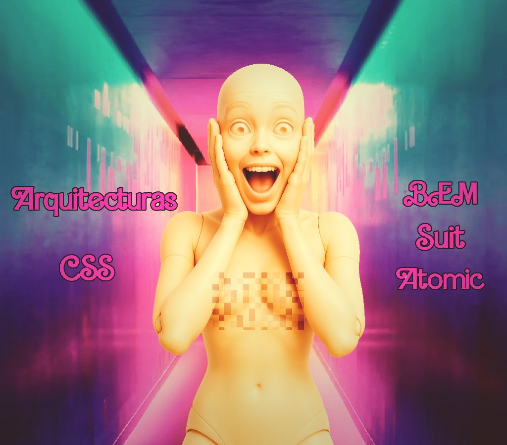

## 👗🎨​​ Píldora Formativa: Arquitecturas CSS

  

Este proyecto forma parte de una Píldora Formativa dedicada a las arquitecturas CSS, donde aprenderás a organizar y estructurar tus estilos para desarrollar proyectos web más mantenibles, escalables y eficientes.

## ✏️​ ¿Qué vas a aprender?

- Conceptos clave y fundamentos de las arquitecturas CSS más populares: **BEM**, **SUIT CSS** y **Atomic CSS**.
- Las ventajas de aplicar estas metodologías en tus proyectos, mejorando la legibilidad, evitando conflictos y facilitando el trabajo en equipo.
- Cómo estas arquitecturas ayudan a mantener el código modular y fácil de mantener a medida que los proyectos crecen.

---

## 🍿 Sobre la presentación

La presentación que acompaña esta píldora es dinámica y amena, diseñada para facilitar la comprensión de conceptos técnicos a través de analogías visuales. Utiliza como ejemplo las muñecas, que al inicio son como un lienzo en blanco: sin ropa ni peinado, no transmiten personalidad. Al vestirlas, peinarlas y añadir accesorios, se define su estilo y carácter, del mismo modo que las arquitecturas CSS ayudan a dar identidad, coherencia y orden visual a una página web.

Puedes acceder a la presentación aquí:

[Arquitecturas-CSS](https://nueva-presentacion.my.canva.site/arquitecturas-css)

---
## Proyecto práctico

Incluye una web de ejemplo donde podrás navegar y visualizar cuatro implementaciones prácticas de las arquitecturas explicadas, permitiéndote ver los resultados y aplicar los conceptos en un entorno real.

  

---

*"La arquitectura del código es tan importante como la arquitectura del edificio; sin una base sólida, nada se mantiene en pie."*

---

  

